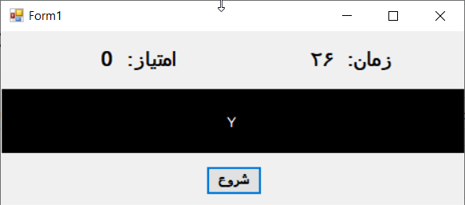

# C# Letter Typing Game

A simple letter typing game developed using C# and Windows Forms.

The game generates random English letters and asks the player to type the displayed letter correctly before the timer runs out.

## Features

* Random English letter generation
* Keyboard input detection
* Real-time letter checking
* Score system
* Countdown timer
* Sound feedback for correct and incorrect answers
* Game-over condition for incorrect input
* Final performance message based on the player's score

## How the Game Works

1. The game displays a random English letter.
2. The player presses the corresponding key on the keyboard.
3. If the entered letter is correct, the score increases and a new letter is generated.
4. If the player enters an incorrect letter, the game ends.
5. The timer counts down during the game.
6. When the timer reaches zero, the player's final score is evaluated.
7. A message is displayed based on the achieved score.

## Score System

The game evaluates the player's performance based on the final score:

| Score | Result    |
| ----- | --------- |
| 30+   | Excellent |
| 25–29 | Very Good |
| 20–24 | Good      |
| 15–19 | Average   |
| 10–14 | Weak      |

## Technologies

* C#
* Windows Forms
* .NET
* Visual Studio

## Concepts Used

* Random number generation
* Character and ASCII code conversion
* Keyboard event handling
* Timer events
* Conditional statements
* Score calculation
* User interface design
* Sound feedback

## Screenshots





## How to Run

1. Clone the repository:

```bash
git clone https://github.com/Reyhaneh04/CSharp-Letter-Typing-Game.git
```

2. Open the project in Visual Studio.

3. Open the `.sln` file.

4. Build the project.

5. Run the application.

## Project Structure

```text
CSharp-Letter-Typing-Game/
├── فعالیت منزل 191.csproj
├── App.config
├── Form1.cs
├── Form1.Designer.cs
├── Form1.resx
├── Program.cs
├── Properties/
└── .gitignore
```

## Project

This project was developed as a C# Windows Forms programming project to create a simple typing and reaction game.
